# SocietyHub 

> A full-stack apartment and society management platform designed to simplify resident services, visitor management, maintenance billing, complaints, and amenity bookings.

## Overview

SocietyHub is a role-based society management platform built to digitize common apartment management workflows.

The platform provides separate capabilities for residents, security guards, maintenance staff, and administrators. It uses a React frontend, ASP.NET Core Web API backend, PostgreSQL database, and JWT-based authentication.

The project focuses on practical backend architecture, role-based authorization, database relationships, API design, and real-world business rules such as visitor approval and amenity booking conflict prevention.

---

## Key Features

### 👤 Role-Based Access

SocietyHub supports multiple user roles:

- **Resident** — Manage visitors, complaints, maintenance bills, and amenity bookings
- **Security Guard** — Manage visitor entry and exit
- **Maintenance Staff** — Support maintenance-related workflows
- **Admin** — Manage residents, maintenance bills, amenities, bookings, and society-level operations

Access to APIs is controlled using JWT authentication and role-based authorization.

---

### Smart Visitor Management

Residents can manage expected visitors through an approval-based workflow.

**Workflow:**

```text
Create Visitor
      ↓
Pending
      ↓
Resident Approval
      ↓
Approved
      ↓
Generate QR Pass
      ↓
Security Scans QR
      ↓
Visitor Entered
      ↓
Visitor Exited

## Application Screenshots

### Login

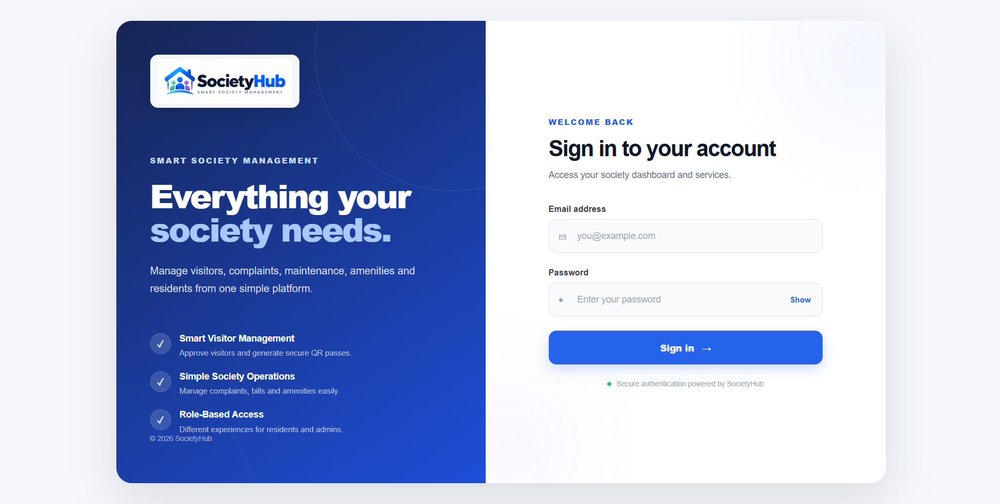

### Resident Dashboard

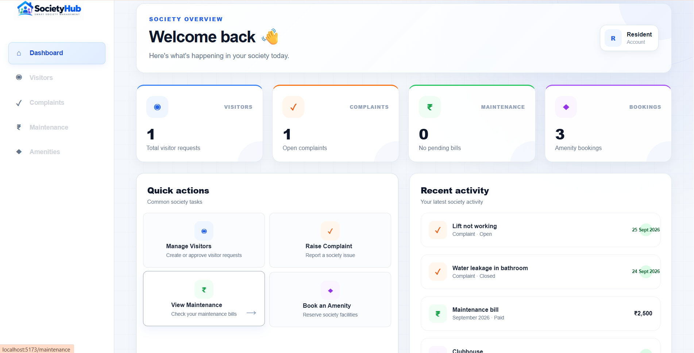

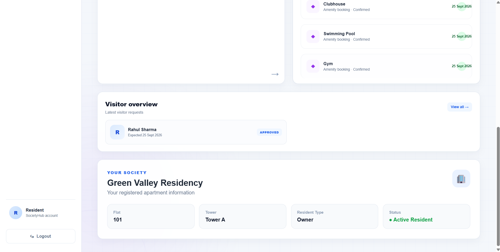

### Visitor Management

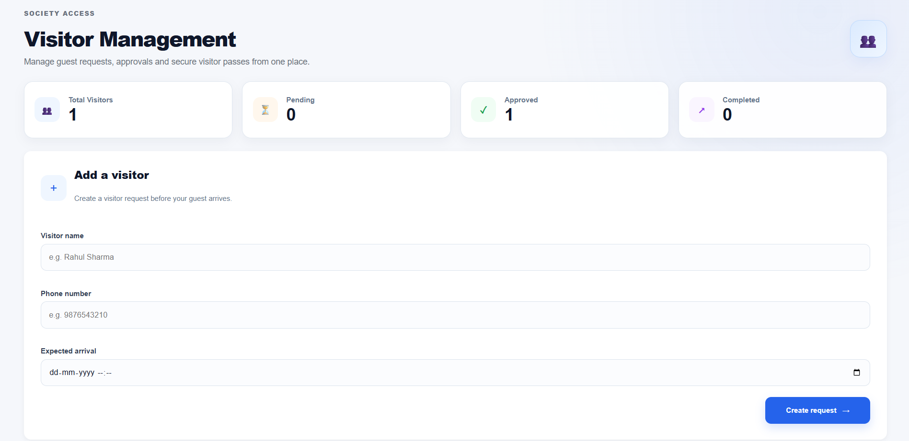

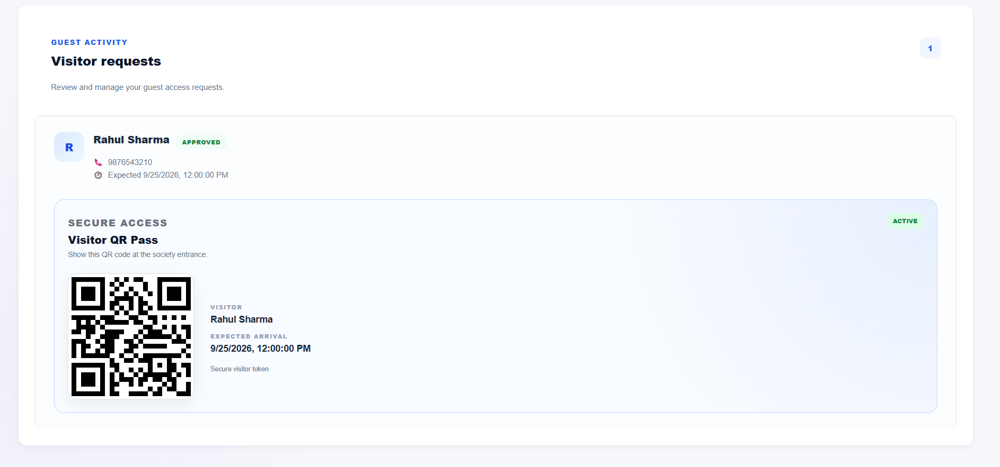

### Complaint Management

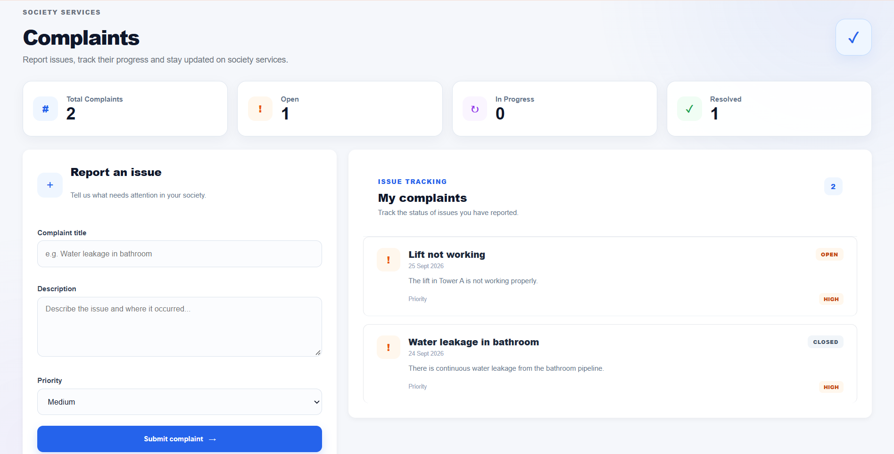

### Maintenance Billing

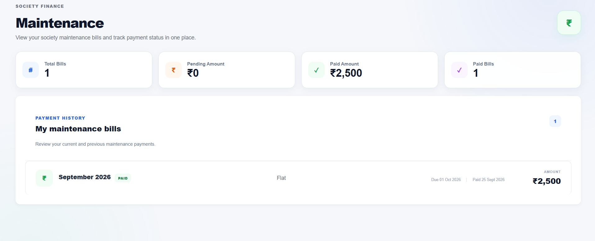

### Amenity Booking

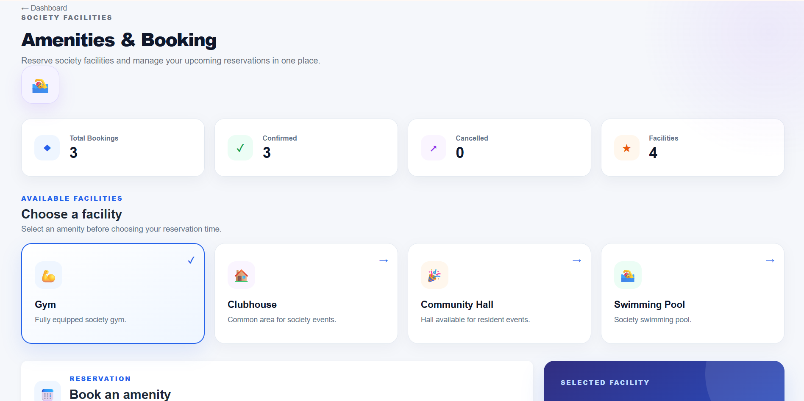

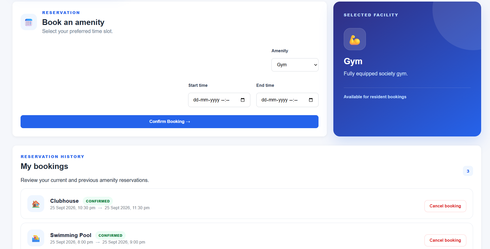

### Admin Dashboard

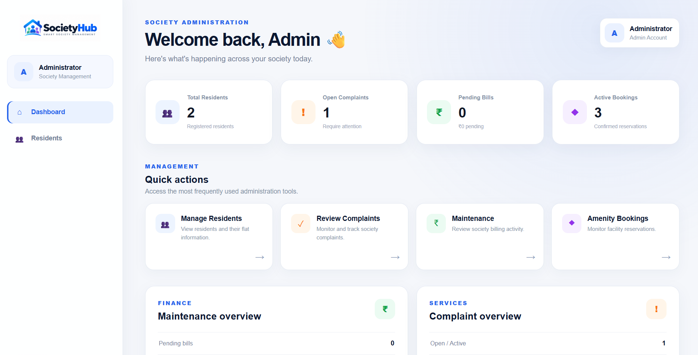

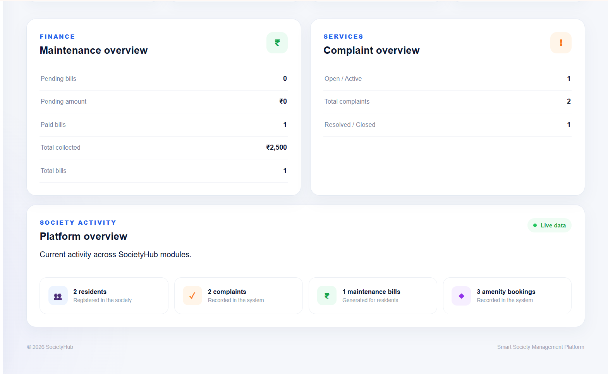

### Resident Management

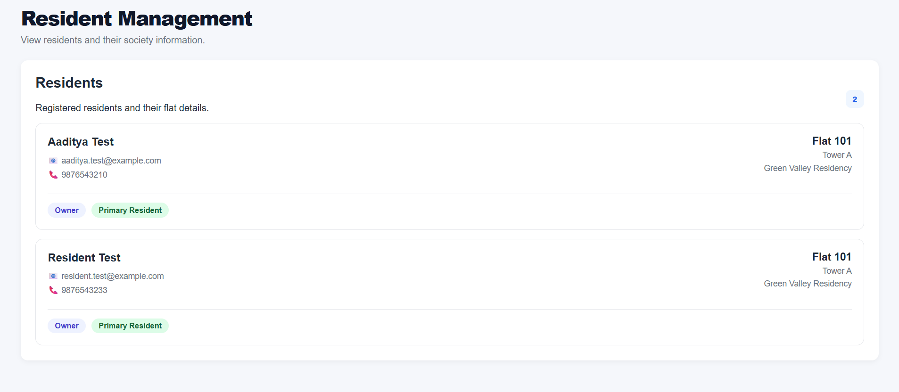

### API Documentation

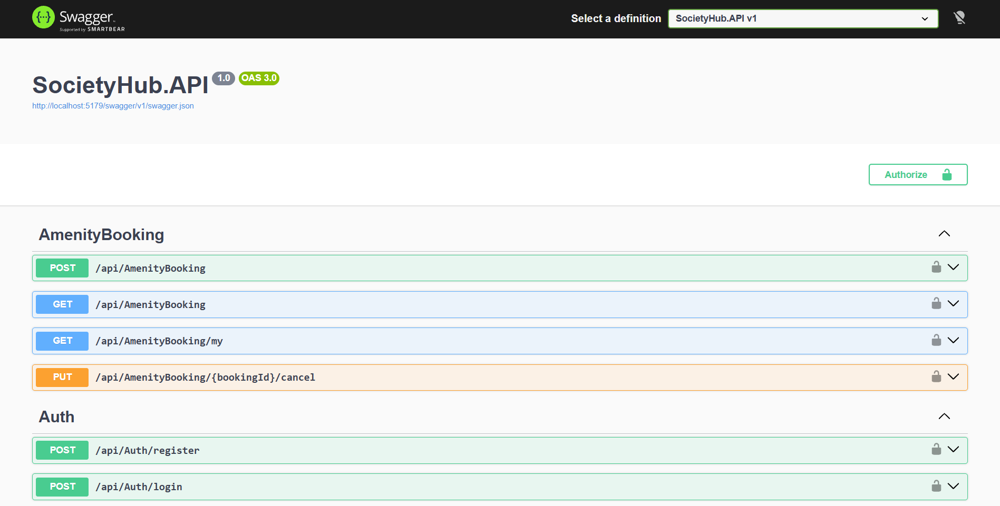